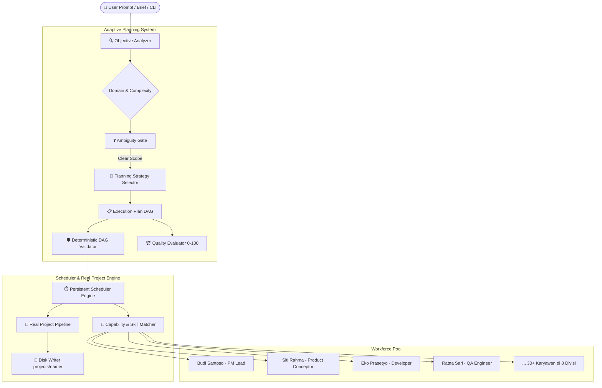

<div align="center">

# 🏢 AETHER OFFICE
### Autonomous Multi-Agent AI Office & Adaptive Planning Engine

[](https://github.com/AarsyDesign/Aether-Office/actions/workflows/ci.yml)
[](https://www.python.org/)
[](LICENSE)

*Transform human vision into real software through an autonomous, structured, multi-agent AI workforce.*

[⚡ Quickstart](#-quickstart) • [🏛️ Architecture](#-architecture) • [👥 Workforce Structure](#-workforce-structure) • [💻 CLI Reference](#-cli-command-reference)

</div>

---

## 🌟 Apa Itu Aether Office?

Bukan sekadar wrapper prompt biasa, **Aether Office** memodelkan **organisasi AI otonom terstruktur secara menyeluruh**:
- **30+ Talenta Karyawan AI Spesialis** terdistribusi di **8 Departemen** (*Engineering, Product, Design, Marketing, Research, Operations, Business, Support*).
- **Adaptive Planning Engine**: Memecah brief/objektif bisnis yang kompleks menjadi Directed Acyclic Graph (DAG) tugas dengan evaluasi kelayakan skor 0-100 secara deterministik.
- **Eksekusi Proyek Nyata**: Tim agen (PM, Conceptor, Developer, QA) bekerja secara kolaboratif memproduksi berkas kode nyata di disk (`projects/<name>/`).
- **Telemetry & Central Router**: Mendukung perutean model LLM dinamis per peran/tugas dan pencatatan aktivitas komputasi & anggaran secara real-time di database SQLite lokal.

---

## ⚡ Quickstart

### 1. Instalasi Otomatis (Windows)
Cukup jalankan script:
```cmd
.\setup.bat
```
Script ini akan membuat virtual environment `.venv` dan memasang seluruh dependensi inti.

### 2. Instalasi Manual
```bash
python -m venv .venv
# Windows:
.\.venv\Scripts\activate
# Linux/Mac:
source .venv/bin/activate

pip install -e .
```

### 3. Konfigurasi LLM
Salin atau sesuaikan [config.yaml](config.yaml):
```yaml
llm:
  endpoint: "http://localhost:20128/v1"
  api_key: "your-api-key"
  model: "default-model"
```

### 4. Menjalankan Workflow Agen
```cmd
# 1. Periksa kesiapan kantor dan seluruh karyawan AI
.\aether.bat office status

# 2. Periksa daftar karyawan dan divisinya
.\aether.bat employees

# 3. Jalankan pengerjaan proyek (Langsung ketik ide Anda)
.\aether.bat run "Buat REST API manajemen inventaris dengan SQLite"

# Atau jalankan menggunakan file brief:
.\aether.bat run briefs/cashier-pondok.md
```

> 💡 **Tips Windows PowerShell:**
> Di PowerShell, selalu gunakan awalan `.\` (contoh: `.\aether` atau `.\aether.bat`), bukan `aether` tanpa titik. Alternatif lainnya, Anda bisa menggunakan `python cli.py <perintah>`.

---

## 📖 Panduan Praktis & Tanya Jawab (FAQ)

### ❓ 1. Apakah Harus Manual Memilih Agent?
> **TIDAK PERLU! Sistem bekerja 100% Otonom.**
Saat Anda menjalankan perintah `.\aether run "<ide proyek>"`, Anda tidak perlu memilih siapa yang menjadi PM atau siapa programmer-nya. Sistem Aether Office secara otomatis mengorkestrasi pipeline 4-fase:
1. **Project Manager (`Budi Santoso`)** ➔ Otomatis membedah brief Anda menjadi tugas-tugas terstruktur.
2. **Product Conceptor (`Siti Rahma`)** ➔ Otomatis menyusun spesifikasi teknis dan kriteria penerimaan.
3. **Developer (`Eko Prasetyo`)** ➔ Otomatis menulis file kode nyata (`core.py`, modul aplikasi).
4. **QA Engineer (`Ratna Sari`)** ➔ Otomatis memvalidasi sintaks dan mengaudit kode.

*Hasil pengerjaan otomatis tersimpan rapi di folder `projects/<nama-proyek>/`.*

---

### ❓ 2. Apakah Dijalankan di Terminal atau Cukup Perintah di IDE?
Anda memiliki dua cara fleksibel:

* **Opsi A: Melalui Terminal Bawaan IDE (Sangat Disarankan)**
  Buka terminal terintegrasi di Antigravity / VS Code (tekan tombol shortcut ``Ctrl + ` ``), lalu ketik perintah:
  ```cmd
  .\aether.bat office status
  .\aether.bat run "Brief proyek Anda"
  ```
* **Opsi B: Langsung Melalui AI Pair Programmer di IDE**
  Jika Anda sedang membuka IDE Antigravity, Anda cukup meminta langsung di chat:
  > *"Tolong jalankan pipeline pengerjaan untuk aplikasi kasir berdasarkan briefs/cashier-pondok.md"*
  
  Asisten AI di IDE akan langsung mengeksekusi perintah CLI dan melaporkan progresnya kepada Anda.

---

### ❓ 3. Perbedaan `office status` vs `status <project_id>`
* **`.\aether.bat office status`** ➔ Memeriksa **kesehatan seluruh kantor** (runtime status, detak scheduler, jumlah karyawan yang tersedia/sibuk, dan kuota anggaran).
* **`.\aether.bat status <project_id>`** ➔ Memeriksa **progres proyek spesifik** yang sudah dibuat (contoh: `.\aether.bat status cashier-pondok-12345`).
* **`.\aether.bat list`** ➔ Menampilkan seluruh ID proyek yang pernah dibuat.

---


## 🏛️ Architecture



---

## 💻 CLI Command Reference

Eksekusi CLI global menggunakan `.\aether.bat <perintah>` atau `python cli.py <perintah>`:

| Perintah | Deskripsi |
| :--- | :--- |
| `aether run "<brief>"` | Menjalankan pipeline pembuatan aplikasi secara otonom |
| `aether office status` | Memeriksa status operasional kantor, antrean, dan runtime |
| `aether employees` | Menampilkan daftar seluruh karyawan, keahlian, dan status ketersediaan |
| `aether departments` | Menampilkan daftar 8 divisi organisasi |
| `aether objective list` | Memantau seluruh objektif bisnis yang terdaftar |
| `aether objective create "<title>"` | Mendaftarkan objektif bisnis baru beserta kriteria penerimaan |
| `aether models` *(alias: `router`)* | Menampilkan status LLM Router dan mapping model per peran |
| `aether list` | Melihat daftar seluruh proyek yang pernah dibuat |
| `aether status <project_id>` | Memeriksa rincian tugas dan riwayat eksekusi proyek |
| `aether usage` | Laporan konsumsi token dan estimasi biaya LLM |

---

## 🤝 Lisensi

Proyek ini dilisensikan di bawah [MIT License](LICENSE).
