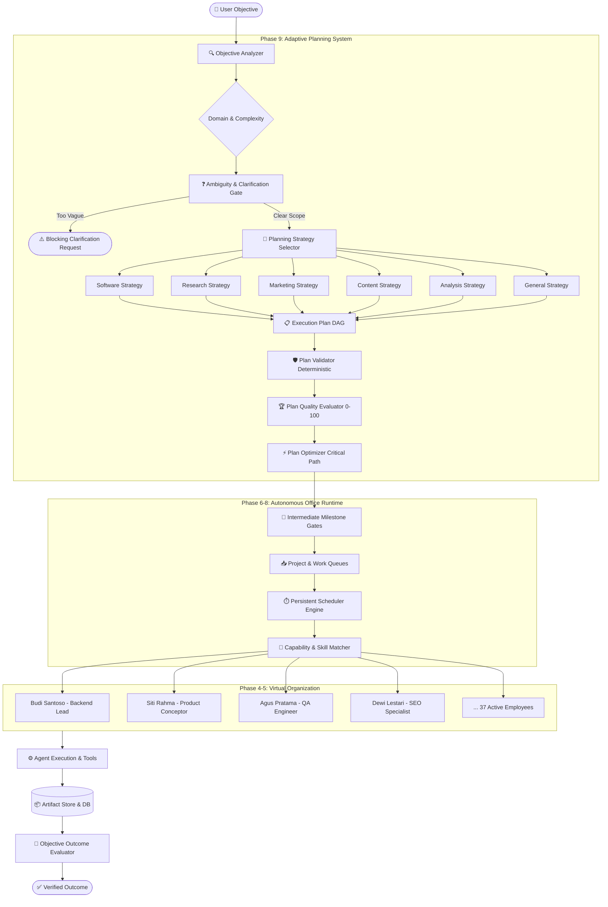

<div align="center">

# 🏢 AETHER OFFICE
### Autonomous Multi-Agent AI Office & Adaptive Planning Engine

[](https://github.com/AarsyDesign/Aether-Office/actions/workflows/ci.yml)
[](https://github.com/AarsyDesign/Aether-Office)
[](https://www.python.org/)
[](https://opensource.org/licenses/MIT)
[](docs/phases/PHASE_9.md)

*Transform high-level human objectives into fully executed, verified outcomes through a persistent virtual AI organization.*

[Quickstart](#-quickstart-in-3-minutes) • [Architecture](#-architecture) • [Key Capabilities](#-key-capabilities) • [CLI Reference](#-cli-command-reference) • [Examples](#-examples) • [Documentation](#-documentation)

</div>

---

## 🌟 What is Aether Office?

Most AI agent frameworks are either single-prompt wrappers or fragile task loops that crumble on complex projects. 

**Aether Office** is fundamentally different: it models an **entire autonomous virtual company**. It coordinates **8 specialized departments** and **37 dynamic employees** (with authentic Indonesian identities) under a persistent scheduler runtime, crash recovery mechanisms, deterministic DAG validation, and an **Adaptive Planning System** that determines the best execution strategy for any objective—whether Software Engineering, Market Research, Digital Marketing, Content Production, or Financial Analysis.

---

## 🏛️ Architecture



---

## 🚀 Key Capabilities

### 1. 🧠 Multi-Domain Adaptive Planning (Phase 9)
Rather than forcing a rigid *"Research → Design → Code → QA"* pipeline, Aether Office selects domain-tailored decomposition strategies:
* **Software**: `Discovery → Design → Implementation → Testing → Deployment`
* **Research**: `Scope → Data Collection → Comparative Analysis → Synthesis → Executive Report`
* **Marketing**: `Research → Strategy → Creative Content → Distribution → Analytics`
* **Content**: `Content Brief → Source Research → Writing → Editorial Review → Publishing`
* **Analysis**: `Data Extraction → Data Cleaning → Statistical Analysis → Quality Validation → Recommendations`

### 2. 🛡️ Ambiguity & Clarification Gate
Prevents wasting budget and tokens on vague instructions (e.g., *"Make a cool app"*). The analyzer calculates ambiguity scores [0.0–1.0] and issues structured `ClarificationRequest` objects with `blocking=True` until scope and target users are defined.

### 3. 🏢 37 Specialized Indonesian Roles across 8 Departments
Full organization roster featuring roles such as *Product Manager, Software Architect, Security Engineer, UX Researcher, Copywriter, Performance Marketing Specialist, Data Analyst, Financial Analyst*, and *DevOps Specialist*.

### 4. ⏱️ Autonomous Scheduler & Continuous Runtime (Phase 6 & 7)
* Persistent in-process heartbeat with idempotent tick cycles.
* Concurrency limits, employee reservation lockouts, and resource budget tracking.
* Cold-start crash recovery: restarts mid-flight without losing state or duplicating work.

### 5. 🏆 Multi-Dimensional Plan Quality & Optimization
Evaluates every generated plan across 5 dimensions:
* **Completeness** (0–20) • **DAG Validity** (0–20) • **Capability Coverage** (0–20) • **Budget Feasibility** (0–20) • **Acceptance Criteria Coverage** (0–20).
* Automatically calculates topological **critical paths**, tags parallelizable tasks, and downscales model tiers when budget is tight.

### 6. 🚧 Intermediate Milestone Gating
Milestones are validated incrementally during runtime. If deliverables fail milestone criteria, revision tasks are injected dynamically before scheduling subsequent phases.

---

## ⚡ Quickstart in 3 Minutes

### 1. Installation

Clone the repository and install with `uv` (recommended) or `pip`:

```bash
git clone https://github.com/AarsyDesign/Aether-Office.git
cd Aether-Office

# Using uv
uv venv
source .venv/bin/activate  # On Windows: .venv\Scripts\activate
uv pip install -e .

# Or using pip
python -m venv .venv
source .venv/bin/activate  # On Windows: .venv\Scripts\activate
pip install -e .
```

### 2. Configure LLM Endpoint

Copy the example configuration:

```bash
cp config.example.yaml config.yaml
```

Aether Office works with any **OpenAI-compatible** endpoint (Ollama, vLLM, LM Studio, OpenAI, or local proxies):

```yaml
llm:
  endpoint: "http://localhost:11434/v1"
  api_key: "your-api-key-here"
  model: "llama3"
  temperature: 0.7
  max_tokens: 4096
```

### 3. Run Your First Objective

Run the interactive quickstart example:

```bash
python examples/01_quickstart_objective.py
```

Or use the global `aether` CLI:

```bash
# Analyze an objective's domain, complexity, and risks
aether objective analyze <objective_id>

# Generate and inspect an adaptive execution plan
aether objective plan <objective_id>

# Run full development pipeline from a project brief
aether run briefs/todo-app.md
```

---

## 💻 CLI Command Reference

After installation, the `aether` executable is available globally:

| Command | Description |
| :--- | :--- |
| `aether run <brief_file>` | Run full development pipeline from a specification markdown |
| `aether list` | List all projects, status, and completion metrics |
| `aether status <project_id>` | Show detailed task breakdown and execution status |
| `aether events <project_id>` | Stream real-time events published across the organization |
| `aether departments` | List all 8 organization departments |
| `aether roles` | List all 37 specialized roles |
| `aether employees` | List active Indonesian employees and their capabilities |
| `aether objective analyze <id>` | **(Phase 9)** Inspect objective classification, complexity, and ambiguity |
| `aether objective plan <id>` | **(Phase 9)** Formulate adaptive milestones, tasks, and critical path |
| `aether objective risks <id>` | **(Phase 9)** Audit 7 categories of project risks |
| `aether objective plan-quality <id>` | **(Phase 9)** Audit plan quality score (0–100) and DAG validity |
| `aether dashboard` *(or `ui`)* | **(Game Dashboard)** Launch the interactive Virtual Office Tycoon game dashboard |

---

## 🎮 Virtual Office Game Dashboard

Aether Office includes an optional, retro tycoon-style visual dashboard (inspired by *Game Dev Tycoon*, *Theme Hospital*, and *SimCity*).

It visualizes the autonomous organization as a living, breathing virtual company:

* **Interactive Floor Plan**: 8 distinct department suites (*Engineering, Product, Business, Design, Marketing, Research, Operations, Support*) with workstations, glowing monitor LEDs, and animated status bubbles (💬 Coding, 💡 Brainstorming, ☕ Coffee Break, 💤 Standby).
* **RPG Character Sheets**: Click any employee workstation to inspect their full dossier: Level, Class (e.g. *Code Alchemist, Prompt Artisan*), capability badges, active task, and personality profile.
* **Corporate Campaigns & Quests**: Track active business objectives, milestone gate progress, budget burn rates, and feasibility grades.
* **8-Bit Audio Synthesizer**: Pure in-browser Web Audio API effects (coin chime on task completion, mechanical tick blip, fanfare on victory) with instant mute toggle. Zero external audio files required!
* **CRT Arcade Scanlines**: Toggle authentic retro arcade scanline overlays.
* **Decoupled Observer Pattern**: Reads from `OfficeOrchestrator` and `tasks.db` without altering scheduling integrity.

### Installing & Running the Game Dashboard

The UI is an **optional extension** to keep the core library ultra-lightweight:

```bash
# Install optional UI dependencies (FastAPI & Uvicorn)
pip install "aether-office[ui]"

# Launch the game dashboard (opens browser at http://127.0.0.1:8000)
aether dashboard
# or:
python cli.py dashboard
```

### Custom Assets & Sprites Support

Aether Office includes procedural SVG pixel art avatars that work out-of-the-box. If you want to use custom pixel art, custom sprites, or custom BGM, drop your files directly into:

* `ui/assets/custom/avatars/<employee_id>.png` (e.g. `pm_001.png` or `default.png`)
* `ui/assets/custom/rooms/` (custom floor/wall tiles)
* `ui/assets/custom/logo/` (custom corporate logo)
* `ui/assets/custom/audio/` (custom BGM / sound effects)

See [ui/assets/custom/README.md](ui/assets/custom/README.md) for recommended resolutions and sprite sheet guides.

---

## 🧪 Testing & Verification

Aether Office enforces a **Zero Regression Policy**. The test suite contains **239 rigorous unit, integration, and crash recovery tests**:

```bash
# Run entire test suite
pytest -v

# Run Game Dashboard tests
pytest test_dashboard.py -v

# Run Phase 9 Adaptive Planning tests
pytest test_adaptive_planning.py -v

# Run Phase 8 Objective Engine tests
pytest test_objective.py -v

# Run Phase 7 Persistent Runtime tests
pytest test_runtime.py -v
```

```text
============================ 239 passed in 40.36s =============================
```

---

## 📂 Repository Structure

```text
aether-office/
├── docs/                   # Architectural specs & design records
│   ├── phases/             # Detailed engineering specs (Phase 1 - Phase 9)
│   └── specs/              # PRD and core conceptual designs
├── ui/                     # Virtual Office Tycoon Game Dashboard (HTML5, CSS3, JS)
│   ├── index.html          # Retro Tycoon HUD & 8-Room Floor Plan
│   ├── style.css           # Pixel styling, glowing monitors, scanline shader
│   ├── app.js              # Real-time SSE listener, procedural pixel avatars & 8-bit audio
│   └── assets/custom/      # Custom pixel sprites & audio asset slot
├── dashboard.py            # FastAPI dashboard server & SSE event streamer
├── adaptive_planner.py     # Adaptive planning orchestrator & safe LLM boundary
├── analysis.py             # ObjectiveAnalyzer, domain classifier & ambiguity gate
├── strategies.py           # 6 domain strategies (Software, Research, Marketing, etc.)
├── plan_evaluator.py       # PlanQualityEvaluator (0-100) & PlanOptimizer
├── milestone_gate.py       # Intermediate milestone quality gates
├── office.py               # OfficeOrchestrator coordinating shared workforce
├── scheduler.py            # SchedulerEngine with heartbeat & employee reservation
├── runtime.py              # Persistent OfficeRuntime lifecycle
├── objective_orchestrator.py # Objective lifecycle & outcome verification
├── workforce.py            # Organization, 8 Departments, 37 Roles & Employees
├── matcher.py              # TaskMatcher capability matching algorithm
├── db.py                   # SQLite persistence (WAL mode, crash recovery)
├── events.py               # EventBus and envelope streaming
├── cli.py                  # CLI implementation (`aether`)
├── examples/               # Runnable demonstration scripts
│   ├── 01_quickstart_objective.py
│   ├── 02_workforce_inspection.py
│   └── 03_adaptive_planning_domains.py
├── pyproject.toml          # Modern PEP 517/518 packaging configuration
├── config.example.yaml     # Safe configuration template
└── .github/workflows/ci.yml# Multi-OS & Multi-Python CI pipeline
```

---

## 🗺️ Architectural Roadmap & Specifications

Explore the detailed architecture and evolutionary engineering specifications:

- [x] **[Phase 1 — Foundation](docs/phases/PHASE_1.md)**: Core pipeline, LLM wrapper, SQLite audit trail.
- [x] **[Phase 1.5 — Reliability](docs/phases/PHASE_1_5.md)**: Retry policies, error categorizer, syntax verification.
- [x] **[Phase 2 — Chunked Developer](docs/phases/PHASE_2.md)**: Context-aware modular code synthesis.
- [x] **[Phase 3 — Streaming & EventBus](docs/phases/PHASE_3.md)**: Real-time event streaming, event replay, agent state tracking.
- [x] **[Phase 4 — Organization & Workforce](docs/phases/PHASE_4.md)**: 8 Departments, 37 Seed Roles, Indonesian workforce pool.
- [x] **[Phase 5 — Dynamic Team Collaboration](docs/phases/PHASE_5.md)**: Delegation engine, handoffs, peer reviews, discussions.
- [x] **[Phase 6 — Multi-Project Scheduler](docs/phases/PHASE_6.md)**: Concurrency control, priority queues, resource safety.
- [x] **[Phase 6.5 — Hardening Audit](docs/phases/PHASE_6_5_AUDIT.md)**: Idempotency checks, transaction integrity, crash resilience.
- [x] **[Phase 7 — Persistent Runtime Engine](docs/phases/PHASE_7.md)**: Worker threads, heartbeat ticks, graceful shutdown.
- [x] **[Phase 8 — Objective-to-Outcome Engine](docs/phases/PHASE_8.md)**: Declarative objectives, outcome verification, auto-revisions.
- [x] **[Phase 9 — Adaptive Planning & Intelligence](docs/phases/PHASE_9.md)**: Multi-domain strategies, ambiguity gate, risk analyzer, quality scoring, milestone gating.

---

## 🤝 Contributing

Contributions are welcome! Please read our [CONTRIBUTING.md](CONTRIBUTING.md) for details on code style, architecture principles, and submitting pull requests.

---

## 📄 License

This project is licensed under the MIT License — see the [LICENSE](LICENSE) file for details.
