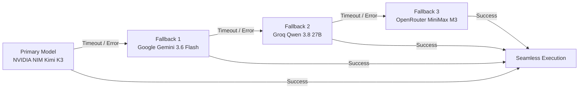
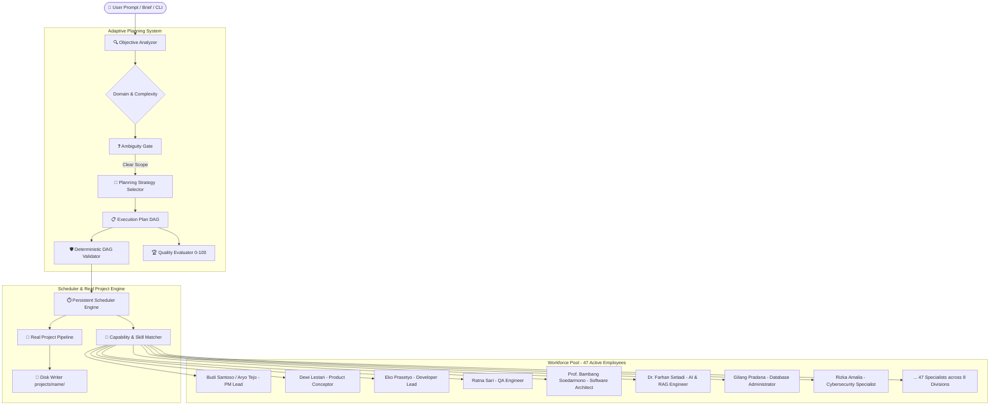

<div align="center">

# 🏢 AETHER OFFICE
### Autonomous Multi-Agent AI Office & Adaptive Planning Engine

[](https://github.com/AarsyDesign/Aether-Office/actions/workflows/ci.yml)
[](https://www.python.org/)
[](LICENSE)

*Transform human vision and project briefs into real, working software through a fully autonomous, structured multi-agent AI workforce.*

[⚡ Quickstart](#-quickstart--installation) • [🎮 2D Virtual Office](#-pixel-agents-2d-virtual-office-simulation) • [🔄 Automatic Failover](#-automatic-llm-failover--fallback-chain) • [🚀 5 Core Commands](#-5-core-commands-how-to-use) • [🤖 AI Configuration](#-ai-configuration-configyaml) • [❓ FAQ](#-practical-guide--faq)

</div>

---

## 🌟 What is Aether Office?

Far more than a simple prompt wrapper, **Aether Office** models a **comprehensive, autonomous virtual software company**:
- **47 Specialized AI Employees** distributed across **8 Departments** (*Engineering, Product, Design, Marketing, Research, Operations, Business, Support*) with **0 vacant roles**.
- **Multi-Provider AI Load-Sharing**: Concurrently utilizes **Google Gemini**, **Groq**, **NVIDIA NIM**, and **OpenRouter** to bypass rate limits and maximize inference speed and depth.
- **100% Autonomous Coordination**: No manual agent selection required. Provide a natural-language prompt or brief file, and the agent hierarchy (PM ➔ Conceptor ➔ Developer ➔ QA) self-organizes to deliver the project.
- **Real Code Generation**: Writes functional codebases directly to disk under `projects/<project-name>/`.
- **Adaptive Planning & Quality Gate**: Decomposes complex objectives into a Directed Acyclic Graph (DAG) of discrete tasks and scores plan viability (0-100) before execution.
- **🎮 2D Pixel-Art Virtual Office**: Native integration with [Pixel Agents](https://github.com/pixel-agents-hq/pixel-agents). Watch your AI employees walk to desks, type, read/write files, and collaborate in a living retro pixel-art office in your browser.
- **🔄 Automatic LLM Failover Chain**: Zero-downtime execution. If your primary AI model hangs, times out, or exhausts quota, Aether Office automatically falls over in seconds (e.g., NVIDIA NIM ➔ Google Gemini ➔ Groq ➔ OpenRouter).

---

## ⚡ Quickstart — Installation

### Step 1: One-Click Environment Setup (Windows)
Run the automated setup script in your terminal:
```cmd
.\setup.bat
```
> *This script automatically creates a `.venv` virtual environment and installs all necessary runtime dependencies.*

### Manual Setup (Optional)
```bash
python -m venv .venv
# On Windows:
.\.venv\Scripts\activate
# On Linux/macOS:
source .venv/bin/activate

pip install -e .
```

---

## 🤖 AI Configuration (`config.yaml`)

Before executing agents with live LLMs, configure your provider in **[config.yaml](config.yaml)**. Aether Office supports single-provider as well as **multi-provider role-based load-sharing**:

```yaml
llm:
  # Default fallback endpoint
  endpoint: "https://generativelanguage.googleapis.com/v1beta"
  api_key: "AIzaSy..."
  model: "gemini-3.6-flash"

# Multi-Provider Role Routing (Anti-Limit & High Speed)
roles:
  qa:
    endpoint: "https://api.groq.com/openai/v1"
    model: "qwen/qwen3.8-27b"
  developer:
    endpoint: "https://integrate.api.nvidia.com/v1"
    model: "deepseek-ai/deepseek-v4-pro-0813"
  conceptor:
    endpoint: "https://generativelanguage.googleapis.com/v1beta"
    model: "gemini-3.6-flash"
  pm:
    endpoint: "https://integrate.api.nvidia.com/v1"
    model: "moonshotai/kimi-k3"
```

### Supported AI Providers:
| Provider | Endpoint | Highlights |
| :--- | :--- | :--- |
| **Google Gemini** *(Cloud)* | `https://generativelanguage.googleapis.com/v1beta` | 1M+ token context window, multimodal, reliable for analysis and concepting |
| **Groq** *(High Speed)* | `https://api.groq.com/openai/v1` | **0.4s response times (Groq LPU)**, ideal for instant code audits, QA & triage |
| **NVIDIA NIM** *(Elite Models)* | `https://integrate.api.nvidia.com/v1` | Hosts DeepSeek-v4 Pro/Flash & Kimi K3 for deep reasoning and code generation |
| **OpenRouter** *(Multi-Model)* | `https://openrouter.ai/api/v1` | Broad access to open and commercial models (MiniMax, Nemotron, Llama) |
| **Ollama / Local** *(Free / Offline)* | `http://localhost:11434/v1` | Fully offline execution with local weights |
| **Offline Mock Mode** | *No setup required* | Append `--mock` to any command for instant offline dry runs |

---

## 🎮 Pixel Agents 2D Virtual Office Simulation

Aether Office includes native integration with **[Pixel Agents](https://github.com/pixel-agents-hq/pixel-agents)**, transforming CLI agent executions into an interactive **2D retro pixel-art office**:

- 🚶 **Live Movement**: AI agents walk to their assigned desks, sit, and start typing.
- 💬 **Speech & Thought Bubbles**: Read real-time agent dialogues, reasoning, and plans.
- 🛠️ **Tool & Terminal Visualization**: See agents interact with files, bash commands, and test suites.

### How to Activate the 2D Visualization:

1. **Start the Pixel Agents Server**:
   Open a separate terminal window and run:
   ```bash
   npx pixel-agents --port 3100
   ```
   *(First run will prompt to install `pixel-agents`; press Enter to proceed).*

2. **Open the 2D Office in Your Browser**:
   Open the URL printed in the terminal, for example:
   ```text
   http://127.0.0.1:3100/?token=YOUR_ACCESS_TOKEN
   ```

3. **Verify Configuration in `config.yaml`**:
   Ensure `pixel_agents` is enabled (it automatically discovers your token from `~/.pixel-agents/config.json`):
   ```yaml
   pixel_agents:
     enabled: true
     auto_discover: true
     host: "127.0.0.1"
     port: 3100
   ```

4. **Run Any Aether Office Command**:
   ```powershell
   .\aether.bat run "Build a weather forecast CLI app"
   ```
   *Watch Budi Santoso (PM), Dewi Lestari (Conceptor), Eko Prasetyo (Developer), and Ratna Sari (QA) walk around and collaborate in real-time in the pixel-art office!*

---

## 🔄 Automatic LLM Failover & Fallback Chain

Never worry about models freezing, rate limits (429), timeouts, or exhausted quotas (401/403). Aether Office features an **autonomous fallback chain**:



### Configuration in `config.yaml`:
```yaml
llm:
  endpoint: "https://integrate.api.nvidia.com/v1"
  model: "deepseek-ai/deepseek-v4-flash-0731"
  timeout: 45           # 45s fast timeout (prevents long freezes)
  max_retries: 2        # Retries before auto-failover

  # Fallback chain: sequentially attempted on error
  fallbacks:
    - gemini
    - groq
    - openrouter
```

When an issue occurs, Aether Office logs the transition smoothly:
```text
[!] Attempt 1/2 [primary (moonshotai/kimi-k3)]: Request timed out (45s)...
[>>] [LLM Failover] primary (moonshotai/kimi-k3) unavailable. Switching to gemini...
SUCCESS! Received response from Google Gemini.
```

---

## 🚀 5 Core Commands (How to Use)

Run these commands from your **Windows Terminal (PowerShell / Command Prompt)**:

### 1️⃣ Check Office Health & Agent Readiness
Inspect runtime status, heartbeat scheduler, and employee availability:
```powershell
.\aether.bat office status
```

### 2️⃣ List 47 Specialized Workforce Employees
View all AI team members, departments, skill sets, and availability:
```powershell
.\aether.bat employees
```

### 3️⃣ Generate a New Application (Direct Prompt)
Provide an application prompt directly in quotes; the autonomous team will plan, design, code, and test it:
```powershell
.\aether.bat run "Build a REST API for task management with SQLite"
```
*(Tip: Append `--mock` for an instant, offline demonstration without using an API key).*

### 4️⃣ Generate from a Project Brief Document
Execute project creation using a structured Markdown brief:
```powershell
.\aether.bat run briefs/todo-app.md
```

### 5️⃣ List All Created Projects
Review the status and IDs of previously generated projects:
```powershell
.\aether.bat list
```

---

## 📁 Where Are Code Deliverables Saved?

Every time `run` executes, Aether Office creates an isolated project directory:
```text
projects/<project-name>-<timestamp>/
  ├── core.py         # Primary application logic and implementation
  ├── test_core.py    # Automated test cases authored by the team
  └── docs/           # Architecture specs and acceptance criteria
```

---

## 📖 Practical Guide & FAQ

### ❓ 1. Do I Need to Manually Choose Agents?
> **NO. The pipeline is 100% Autonomous.**

When you run `.\aether.bat run "..."`, you do not have to select who acts as PM, architect, or developer. The built-in 4-phase pipeline executes automatically:
1. **Project Manager (`Budi Santoso` / `Aryo Tejo`)** ➔ Breaks down your brief into structured, dependent milestones.
2. **Product Conceptor (`Dewi Lestari`)** ➔ Compiles technical specifications and acceptance criteria.
3. **Developer (`Eko Prasetyo`)** ➔ Generates the implementation code file by file.
4. **QA Engineer (`Ratna Sari` / `Fitri Handayani`)** ➔ Validates syntax, reviews code quality, and verifies outputs.

---

### ❓ 2. Should I Run in Terminal or via IDE Commands?
Both methods are fully supported:

* **Option A: Built-in IDE Terminal (Recommended)**
  Open the integrated terminal in Antigravity or VS Code (press ``Ctrl + ` ``), then run:
  ```powershell
  .\aether.bat office status
  .\aether.bat run "Build a CLI expense tracker"
  ```
  > 💡 **PowerShell Tip:** Always use the `.\` prefix (e.g., `.\aether.bat` or `.\aether`), as PowerShell restricts executing from the current directory without it. Alternatively, use `python cli.py <command>`.

* **Option B: Pair Programming Chat in IDE**
  If using Antigravity IDE, you can ask the AI assistant directly in the chat:
  > *"Please run the project pipeline based on briefs/todo-app.md"*
  
  The assistant will execute the CLI engine in the background and report results.

---

### ❓ 3. What Is the Difference Between `office status` and `status <project_id>`?
* **`.\aether.bat office status`** ➔ Checks **global office health** (runtime engine status, scheduler heartbeat, workforce capacity).
* **`.\aether.bat status <project_id>`** ➔ Checks **progress of a specific project** (e.g., `.\aether.bat status todo-app-1788670162`).

---

### ❓ 4. What Does `[WinError 10061] Connection refused` Mean?
This error occurs when Aether Office attempts to contact the LLM endpoint in `config.yaml`, but the local server/proxy is **not running or unreachable**.
* **Remedies:**
  1. If using a local router (e.g., port 20128), start your local proxy process first.
  2. Or update `endpoint` and `api_key` in [config.yaml](config.yaml) to a cloud provider like Google Gemini, Groq, or OpenRouter.
  3. Or test in offline simulation mode using `--mock`:
     ```powershell
     .\aether.bat run "Your project idea" --mock
     ```

---

## 🏛️ Architecture



---

## 💻 CLI Command Reference

Execute globally via `.\aether.bat <command>` or `python cli.py <command>`:

| Command | Description |
| :--- | :--- |
| `aether run "<brief>"` | Run end-to-end autonomous application generation |
| `aether office status` | Inspect office operational status, queue, and runtime |
| `aether employees` | Display workforce directory, skills, and availability |
| `aether departments` | List all 8 organizational divisions |
| `aether objective list` | Monitor all registered business objectives |
| `aether objective create "<title>"` | Register a new business objective with criteria |
| `aether models` *(alias: `router`)* | Inspect LLM router status and role-model mapping |
| `aether list` | List all existing project workspaces |
| `aether status <project_id>` | Inspect task details and execution history for a project |
| `aether usage` | Report token consumption and estimated LLM costs |

---

## 🤝 License

This project is licensed under the [MIT License](LICENSE).
