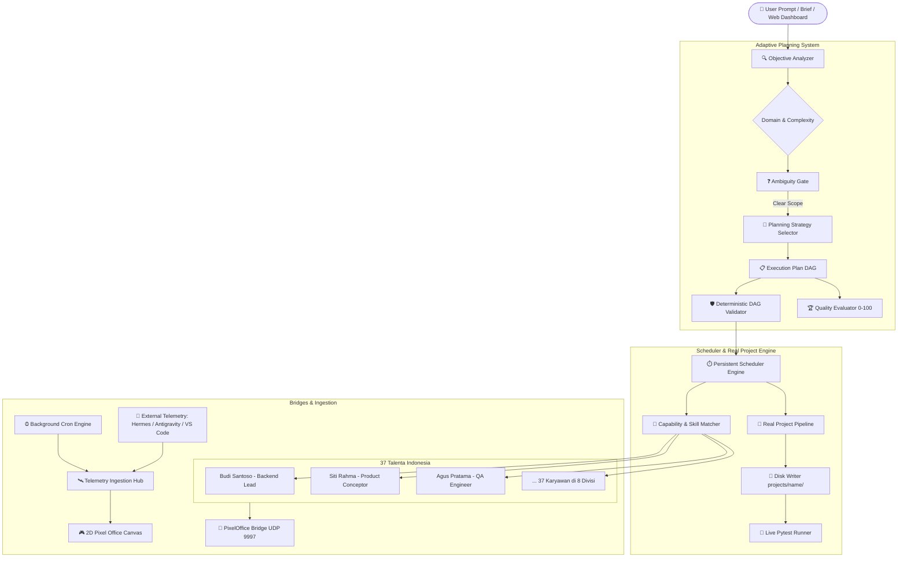

<div align="center">

# 🏢 AETHER OFFICE
### Autonomous Multi-Agent AI Office, 2D Pixel Art Simulator & Adaptive Planning Engine

[](https://github.com/AarsyDesign/Aether-Office/actions/workflows/ci.yml)
[](https://github.com/AarsyDesign/Aether-Office)
[](https://www.python.org/)
[](package.json)
[](LICENSE)
[](pixel_bridge.py)

*Transform human vision into real, tested, working software through a 2D Pixel-Art autonomous AI workforce.*

[⚡ Quickstart (1-Click & NPM)](#-quickstart--instalasi-super-mudah) • [🎮 2D Pixel Canvas](#-2d-pixel-office-canvas-world) • [🚀 Real Code Generation](#-real-code-generation--live-pytest-runner) • [📡 Telemetry & Cron](#-ai-telemetry--background-cron-engine) • [🏛️ Architecture](#-architecture) • [💻 CLI Reference](#-cli-command-reference)

</div>

---

## 🌟 Apa Itu Aether Office?

Bukan sekadar wrapper prompt biasa, **Aether Office** memodelkan **perusahaan virtual otonom secara menyeluruh**:
- **37 Talenta Karyawan Spesialis Indonesia** terdistribusi di **8 Departemen** (*Engineering, Product, Design, Marketing, Research, Operations, Business, Support*).
- **2D Pixel Office Canvas World**: Visualisasi interaktif berbasis retro RPG canvas (merujuk pada arsitektur *PixelOffice*). Karakter pixel mengetik di keyboard, monitor menyala saat coding, partikel uap kopi di espresso bar, whiteboard DAG interaktif, serta hewan peliharaan kantor (*Mimi si kucing* & *Boni si anjing*).
- **Eksekusi Proyek Nyata — Bukan Dummy!**: Tombol **"🚀 BUILD REAL APP"** menggerakkan tim agen (PM, Conceptor, Developer, QA) untuk menulis file kode Python asli di disk (`projects/<name>/`), memeriksa source code di **Code Inspector**, dan menjalankan pengujian **Pytest Live** langsung dari browser.
- **AI Telemetry & Cron Hub**: Menerima sinyal aktivitas agen eksternal (Hermes Agent, Antigravity IDE, VS Code) dan menjadwalkan tugas otomatis di latar belakang.

---

## ⚡ Quickstart & Instalasi Super Mudah

Aether Office kini mendukung metode instalasi 1-klik dan perintah bergaya **NPM** (bagi pengguna Node.js):

### 🌟 Opsi 1: Paling Mudah (1-Klik Tanpa Ketik Apapun)
Cukup **double-click** berkas berikut:
```text
start_dashboard.bat
```
> **Otomatis!** Script ini akan mendeteksi apakah environment virtual (`.venv`) dan dependensi sudah ada. Jika belum, script akan otomatis membuat `.venv`, menginstall library yang dibutuhkan, menjalankan server dashboard, dan membuka browser di `http://127.0.0.1:8000`.

---

### 📦 Opsi 2: Gaya NPM (Untuk Pengguna Node.js)
Jika Anda terbiasa dengan workflow `npm install` dan `npm start`:
```bash
# 1. Setup virtual environment & dependencies otomatis
npm run setup

# 2. Jalankan dashboard server
npm start
# atau:
npm run dev

# 3. Menjalankan unit test
npm test
```

---

### 🐍 Opsi 3: Gaya Python Standar / UV
Bagi pengembang Python:
```bash
# Menggunakan script setup otomatis:
.\setup.bat

# Atau manual via pip:
python -m venv .venv
.\.venv\Scripts\activate      # Di Linux/Mac: source .venv/bin/activate
pip install -e ".[ui]"

# Atau via uv (super cepat):
uv venv
uv pip install -e ".[ui]"

# Jalankan dashboard:
python cli.py dashboard
```
Buka browser di: **`http://127.0.0.1:8000`**

---

## 🎮 2D Pixel Office Canvas World

Engine visual baru [ui/pixel_world.js](ui/pixel_world.js) menghadirkan simulasi kantor retro RPG hidup:
* **8 Ruang Departemen Tematik**: Meja eksekutif CEO, cubicle developer dengan monitor menyala, War Room dengan papan tulis DAG, bar espresso dengan partikel uap kopi, rak server berkedip, sofa santai, dispenser galon bergelembung, dan mesin arcade.
* **Karakter Sprite Pixel 16x24**: Animasi bernapas (*idle breathing*), mengetik cepat (*typing*), dan berjalan (*pathfinding*) menuju coffee machine saat istirahat.
* **Live Speech Bubbles**: Balon percakapan pixel real-time di atas kepala agen (`"💻 Coding core.py..."`, `"🧪 Running pytest..."`, `"📋 Planning DAG..."`, `"☕ Ngopi dulu"`).
* **Office Pets**: *Mimi si kucing* (tidur di karpet / jalan santai) & *Boni si anjing* (berkeliaran di breakroom).
* **Toggle Viewport**: Tombol `[🎮 2D PIXEL VIEW]` / `[📋 ROOM MATRIX]` untuk berganti antara Canvas 2D dan kartu matriks.
* **Audio Synthesizer 8-Bit & CRT Shader**: Efek suara sintetis murni Web Audio API (chime, blip, victory fanfare) & scanline overlay arcade retro tanpa aset eksternal.

---

## 🚀 Real Code Generation & Live Pytest Runner

Bukan sekadar teks simulasi—Aether Office menghasilkan **aplikasi nyata**:
1. **Klik tombol "🚀 BUILD REAL APP"** di pojok kanan atas.
2. **Pilih Template atau Masukkan Brief**:
   - 📝 *CLI Todo Application* (CRUD SQLite + Pytest)
   - 🌐 *FastAPI REST API* (Endpoints, Pydantic Schema, In-Memory Store)
   - 🧮 *Scientific Calculator CLI* (Math Parser + Exponent + Tests)
   - 🌤️ *Weather Tool CLI* (Cache + Data Formatter)
   - ✍️ *Custom Project Prompt* (bebas tentukan ide Anda)
3. **Pipeline Otonom 4 Fase Berjalan**:
   - **Project Manager**: Membedah scope dan membuat milestone task.
   - **Conceptor**: Menyusun spesifikasi teknis dan kriteria penerimaan.
   - **Developer**: Menulis kode terstruktur (`core.py`, `test_core.py`, `brief.md`).
   - **QA Engineer**: Memvalidasi kode dan mengaudit sintaks.
4. **File Tersimpan di Disk**: Seluruh berkas disimpan langsung ke folder `projects/<project_name>/`.
5. **Code Inspector di Browser**: Buka file, baca syntax-highlighted code, salin kode dengan 1-klik.
6. **Tombol "▶️ RUN PYTEST LIVE"**: Menjalankan pytest langsung di backend terhadap kode yang baru dibuat dan menampilkan terminal output di browser!

---

## 📡 AI Telemetry & Background Cron Engine

Aether Office berfungsi sebagai **Mission Control** untuk seluruh aktivitas AI Anda:
* **AI Telemetry Ingestion Hub**: Menerima sinyal aktivitas eksternal dari Hermes Agent, Antigravity IDE, VS Code, atau CLI `aether track`.
  - Meja kerja agen akan menampilkan badge sumber telemetri (`[HERMES]`, `[ANTIGRAVITY]`, `[VS CODE]`, `[CRON]`) dan lampu layar monitor menyala sesuai sumbernya.
* **Automated Cron Engine**: Menjadwalkan tugas berkala otonom di latar belakang (`cron_engine.py`).
  - Fitur tombol **`▶ RUN NOW`** untuk eksekusi langsung dan **`⏸ PAUSE` / `▶ ENABLE`** untuk mengontrol jadwal cron.
* **Protokol PixelOffice Bridge (`pixel_bridge.py`)**:
  - Mengirimkan event agen secara fail-open via UDP `127.0.0.1:9997` dan HTTP POST `http://127.0.0.1:3003/api/events`.

---

## 🏛️ Architecture



---

## 💻 CLI Command Reference

Eksekusi CLI global `aether` atau `python cli.py`:

| Perintah | Deskripsi |
| :--- | :--- |
| `aether dashboard` *(atau `npm start`)* | Menjalankan web visual game dashboard di port 8000 |
| `aether run "<brief>" --mock` | Menjalankan eksekusi build aplikasi otonom (cepat & deterministik) |
| `aether employees` | Menampilkan tabel 37 karyawan dan status departemen |
| `aether departments` | Menampilkan 8 divisi organisasi |
| `aether track --role developer "Task"` | Mengirim sinyal telemetri eksternal ke virtual office |
| `aether cron` | Mengelola dan mengecek jadwal background cron jobs |
| `aether models` *(alias: `router`)* | Menampilkan status LLM Router dan daftar model yang tersedia |
| `aether list` | Melihat daftar seluruh proyek yang pernah dibuat |
| `aether status <project_id>` | Memeriksa rincian task dan status proyek |

---

## 🧪 Testing & Verification

Aether Office menerapkan **Zero Regression Policy**:

```bash
# Menjalankan seluruh test suite (255 tests):
pytest -v
# atau:
npm test
```

```text
======================= 255 passed in 68.58s =======================
```

Mencakup:
- `test_pixel_bridge.py` — Pengujian protokol UDP/HTTP PixelOffice
- `test_dashboard.py` — Pengujian FastAPI endpoints, Real Project pipeline, Code Inspector
- `test_telemetry_cron.py` — Pengujian TelemetryManager, CronEngine, dan SDK Client
- `test_workforce.py` — Pengujian 37 karyawan, 8 departemen, RPG character generator
- `test_runtime.py` — Pengujian lifecycle scheduler, crash recovery, worker loop
- `test_adaptive_planning.py` — Pengujian strategi adaptif, DAG validator, quality evaluation

---

## 🤝 Kontribusi & Lisensi

Proyek ini berlisensi [MIT License](LICENSE). Pull request, masukan, dan ide fitur sangat kami sambut!
