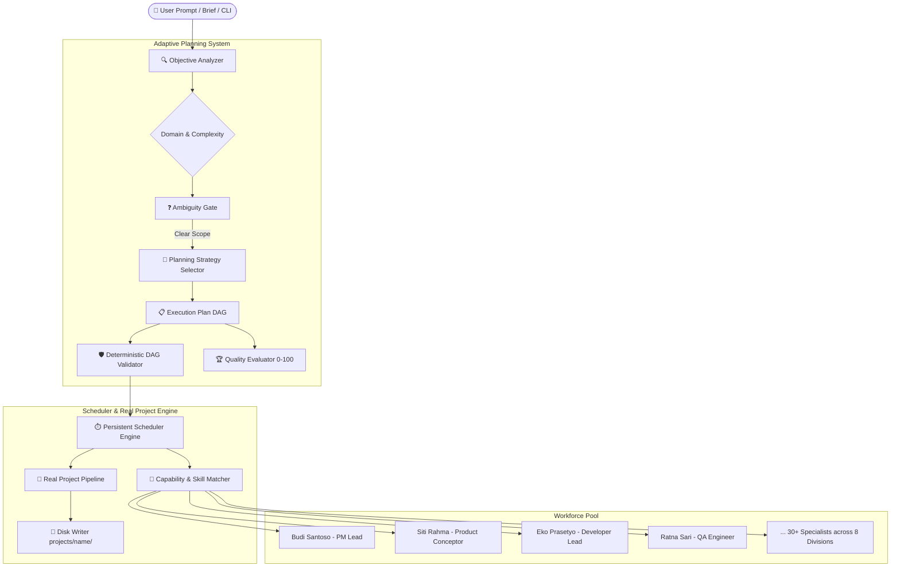

<div align="center">

# 🏢 AETHER OFFICE
### Autonomous Multi-Agent AI Office & Adaptive Planning Engine

[](https://github.com/AarsyDesign/Aether-Office/actions/workflows/ci.yml)
[](https://www.python.org/)
[](LICENSE)

*Transform human vision and project briefs into real, working software through a fully autonomous, structured multi-agent AI workforce.*

[⚡ Quickstart](#-quickstart--installation) • [🚀 5 Core Commands](#-5-core-commands-how-to-use) • [🤖 AI Configuration](#-ai-configuration-configyaml) • [❓ FAQ](#-practical-guide--faq) • [🏛️ Architecture](#-architecture) • [💻 CLI Reference](#-cli-command-reference)

</div>

---

## 🌟 What is Aether Office?

Far more than a simple prompt wrapper, **Aether Office** models a **comprehensive, autonomous virtual software company**:
- **30+ Specialized AI Employees** distributed across **8 Departments** (*Engineering, Product, Design, Marketing, Research, Operations, Business, Support*).
- **100% Autonomous Coordination**: No manual agent selection required. Provide a natural-language prompt or brief file, and the agent hierarchy (PM ➔ Conceptor ➔ Developer ➔ QA) self-organizes to deliver the project.
- **Real Code Generation**: Writes functional codebases directly to disk under `projects/<project-name>/`.
- **Adaptive Planning & Quality Gate**: Decomposes complex objectives into a Directed Acyclic Graph (DAG) of discrete tasks and scores plan viability (0-100) before execution.

---

## ⚡ Quickstart — Installation

### Step 1: One-Click Environment Setup (Windows)
Run the automated setup script in your terminal:
```cmd
.\setup.bat
```
> *This script automatically creates a `.venv` virtual environment and installs all necessary runtime dependencies.*

### Manual Setup (Optional)
```bash
python -m venv .venv
# On Windows:
.\.venv\Scripts\activate
# On Linux/macOS:
source .venv/bin/activate

pip install -e .
```

---

## 🤖 AI Configuration (`config.yaml`)

Before executing agents with live LLMs, configure your provider in **[config.yaml](config.yaml)**:

```yaml
llm:
  endpoint: "https://openrouter.ai/api/v1"   # Any OpenAI-compatible endpoint
  api_key: "sk-or-v1-xxxxxxxxxxxxxxxx"      # Your API key
  model: "meta-llama/llama-3.3-70b-instruct" # Default model
```

### Supported AI Providers:
| Provider | Endpoint | Notes |
| :--- | :--- | :--- |
| **OpenRouter** *(Cloud)* | `https://openrouter.ai/api/v1` | Recommended; broad access to open and commercial models |
| **Groq** *(High Speed)* | `https://api.groq.com/openai/v1` | Fast inference for quick coding iterations |
| **Ollama** *(Local / Free)* | `http://localhost:11434/v1` | Fully offline; ensure Ollama is running locally |
| **Local Proxy / 9router** | `http://localhost:20128/v1` | Ensure your local proxy server is started before running |
| **Offline Mock Mode** | *No setup required* | Append `--mock` to any command for instant offline dry runs |

---

## 🚀 5 Core Commands (How to Use)

Run these commands from your **Windows Terminal (PowerShell / Command Prompt)**:

### 1️⃣ Check Office Health & Agent Readiness
Inspect runtime status, heartbeat scheduler, and employee availability:
```powershell
.\aether.bat office status
```

### 2️⃣ List 30+ Specialized Workforce Employees
View all AI team members, departments, skill sets, and availability:
```powershell
.\aether.bat employees
```

### 3️⃣ Generate a New Application (Direct Prompt)
Provide an application prompt directly in quotes; the autonomous team will plan, design, code, and test it:
```powershell
.\aether.bat run "Build a REST API for task management with SQLite"
```
*(Tip: Append `--mock` for an instant, offline demonstration without using an API key).*

### 4️⃣ Generate from a Project Brief Document
Execute project creation using a structured Markdown brief:
```powershell
.\aether.bat run briefs/todo-app.md
```

### 5️⃣ List All Created Projects
Review the status and IDs of previously generated projects:
```powershell
.\aether.bat list
```

---

## 📁 Where Are Code Deliverables Saved?

Every time `run` executes, Aether Office creates an isolated project directory:
```text
projects/<project-name>-<timestamp>/
  ├── core.py         # Primary application logic and implementation
  ├── test_core.py    # Automated test cases authored by the team
  └── docs/           # Architecture specs and acceptance criteria
```

---

## 📖 Practical Guide & FAQ

### ❓ 1. Do I Need to Manually Choose Agents?
> **NO. The pipeline is 100% Autonomous.**

When you run `.\aether.bat run "..."`, you do not have to select who acts as PM, architect, or developer. The built-in 4-phase pipeline executes automatically:
1. **Project Manager (`Budi Santoso`)** ➔ Breaks down your brief into structured, dependent milestones.
2. **Product Conceptor (`Siti Rahma`)** ➔ Compiles technical specifications and acceptance criteria.
3. **Developer (`Eko Prasetyo`)** ➔ Generates the implementation code file by file.
4. **QA Engineer (`Ratna Sari`)** ➔ Validates syntax, reviews code quality, and verifies outputs.

---

### ❓ 2. Should I Run in Terminal or via IDE Commands?
Both methods are fully supported:

* **Option A: Built-in IDE Terminal (Recommended)**
  Open the integrated terminal in Antigravity or VS Code (press ``Ctrl + ` ``), then run:
  ```powershell
  .\aether.bat office status
  .\aether.bat run "Build a CLI expense tracker"
  ```
  > 💡 **PowerShell Tip:** Always use the `.\` prefix (e.g., `.\aether.bat` or `.\aether`), as PowerShell restricts executing from the current directory without it. Alternatively, use `python cli.py <command>`.

* **Option B: Pair Programming Chat in IDE**
  If using Antigravity IDE, you can ask the AI assistant directly in the chat:
  > *"Please run the project pipeline based on briefs/todo-app.md"*
  
  The assistant will execute the CLI engine in the background and report results.

---

### ❓ 3. What Is the Difference Between `office status` and `status <project_id>`?
* **`.\aether.bat office status`** ➔ Checks **global office health** (runtime engine status, scheduler heartbeat, workforce capacity).
* **`.\aether.bat status <project_id>`** ➔ Checks **progress of a specific project** (e.g., `.\aether.bat status todo-app-1788670162`).

---

### ❓ 4. What Does `[WinError 10061] Connection refused` Mean?
This error occurs when Aether Office attempts to contact the LLM endpoint in `config.yaml`, but the local server/proxy is **not running or unreachable**.
* **Remedies:**
  1. If using a local router (e.g., port 20128), start your local proxy process first.
  2. Or update `endpoint` and `api_key` in [config.yaml](config.yaml) to a cloud provider like OpenRouter or Groq.
  3. Or test in offline simulation mode using `--mock`:
     ```powershell
     .\aether.bat run "Your project idea" --mock
     ```

---

## 🏛️ Architecture



---

## 💻 CLI Command Reference

Execute globally via `.\aether.bat <command>` or `python cli.py <command>`:

| Command | Description |
| :--- | :--- |
| `aether run "<brief>"` | Run end-to-end autonomous application generation |
| `aether office status` | Inspect office operational status, queue, and runtime |
| `aether employees` | Display workforce directory, skills, and availability |
| `aether departments` | List all 8 organizational divisions |
| `aether objective list` | Monitor all registered business objectives |
| `aether objective create "<title>"` | Register a new business objective with criteria |
| `aether models` *(alias: `router`)* | Inspect LLM router status and role-model mapping |
| `aether list` | List all existing project workspaces |
| `aether status <project_id>` | Inspect task details and execution history for a project |
| `aether usage` | Report token consumption and estimated LLM costs |

---

## 🤝 License

This project is licensed under the [MIT License](LICENSE).
